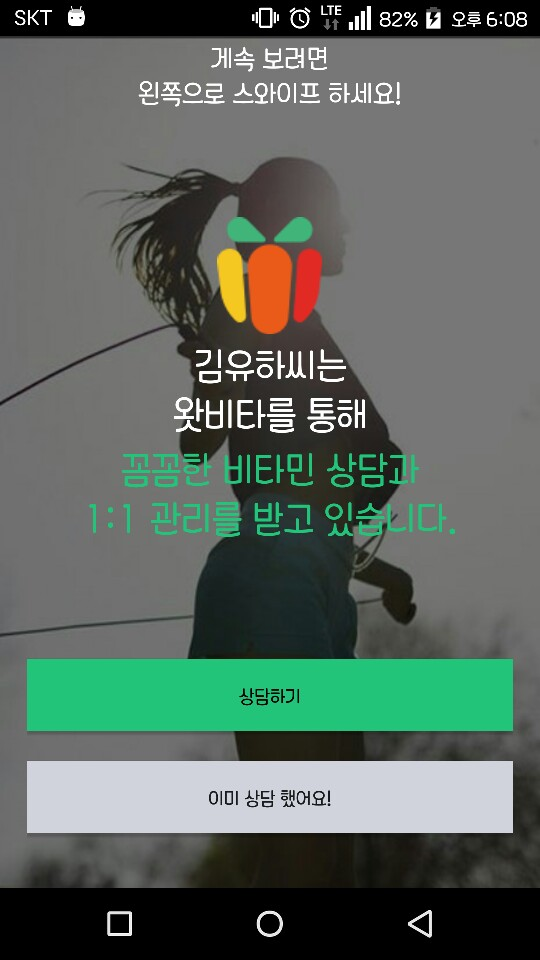
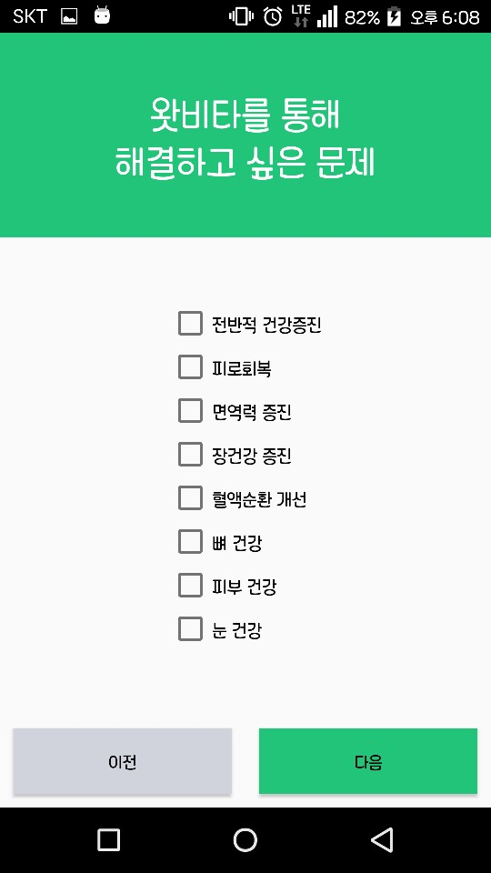
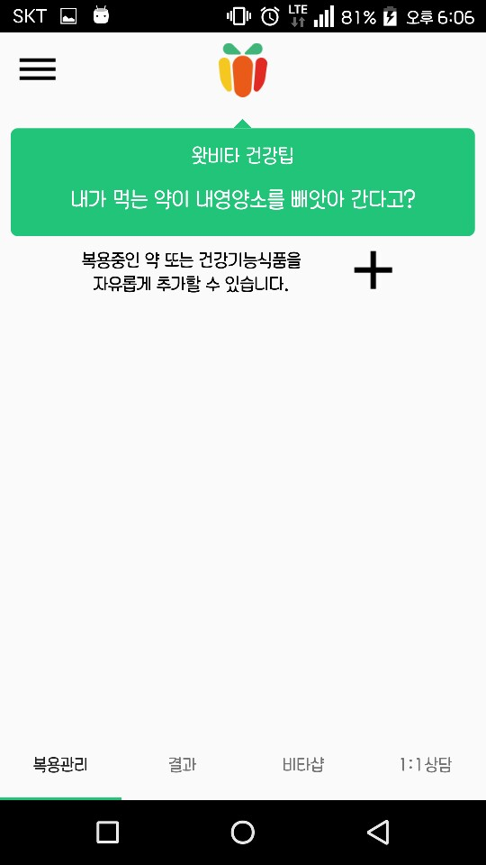
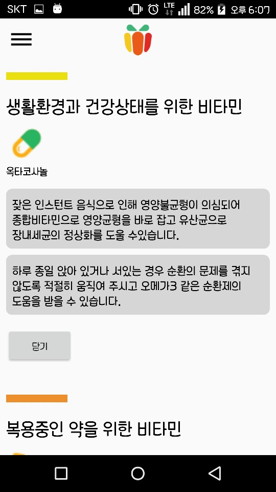
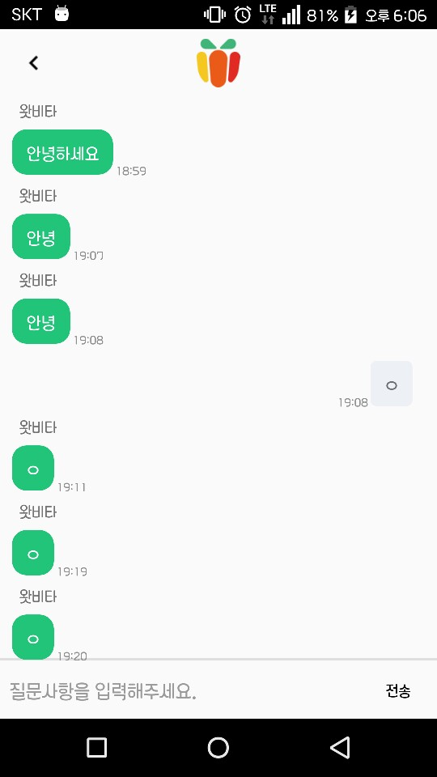
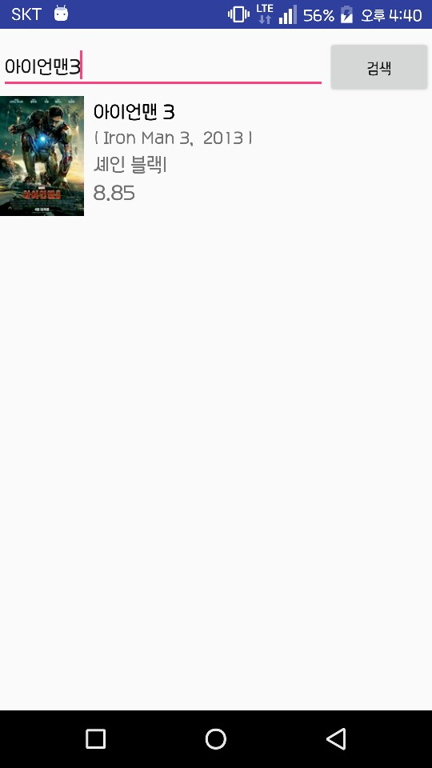
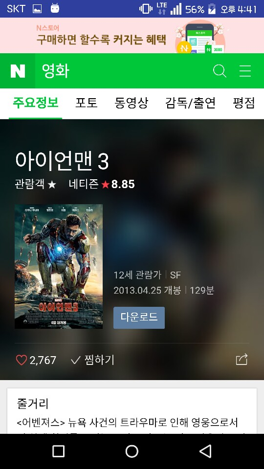

# 김성우

Github: https://github.com/alcnls

# 경력

[왓비타](http://www.whatvita.kr)

* 담당: 안드로이드 개발자
* 기간: 2017.05 ~ 2017.12

쿠키크랙

* 담당: 안드로이드 개발자
* 기간: 2015.09 ~ 2015.12

# 프로젝트

**왓비타**

* 소속: 왓비타
* 담당: 안드로이드 앱 개발자
* 기간: 2017.09 ~ 2017.12
* 사용기술: Java,Retrofit,OkHttp,Rxjava,Lambda ..

 
 

# 기타 프로젝트

**평화촛불**

집회용 촛불 앱

* 상단 TextView는 내용과 위치(상단,하단) 설정 가능합니다.
* Animation-list를 활용 , 20장의 촛불 이미지를 사용하여 타오르는 촛불을 구현.
* 촛불 세기 및 촛불이미지 변경 가능합니다.
* 종이컵 이미지 중앙 구호 설정 기능이 있습니다.
* Handler를 이용한 버튼 자동 숨김.
* SharedPreferences사용으로 개인 설정 유지 가능합니다.

 

**네이버 검색(영화) API**

네이버 검색 API를 이용한 영화검색

* 사용기술: Java,Butterknife,Retrofit,Okhttp,Glide,Recyclerview ..
* Edittext 에 영화제목을 검색하면 검색한 영화가 Recyclerview에 출력됩니다.
* 출력되는 데이터는 제목,영어제목,제작년도,감독,평점,영화이미지 입니다.
* 검색으로 출력된 데이터를 클릭하면 WebView로 클릭한 영화의 자세한 정보페이지로 이동합니다.

 

