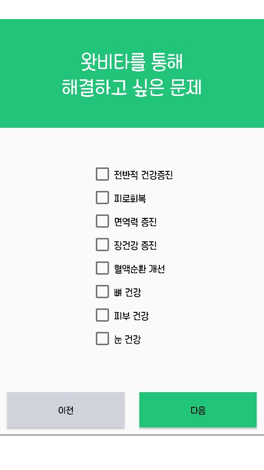
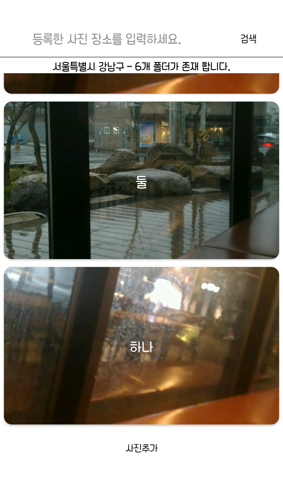
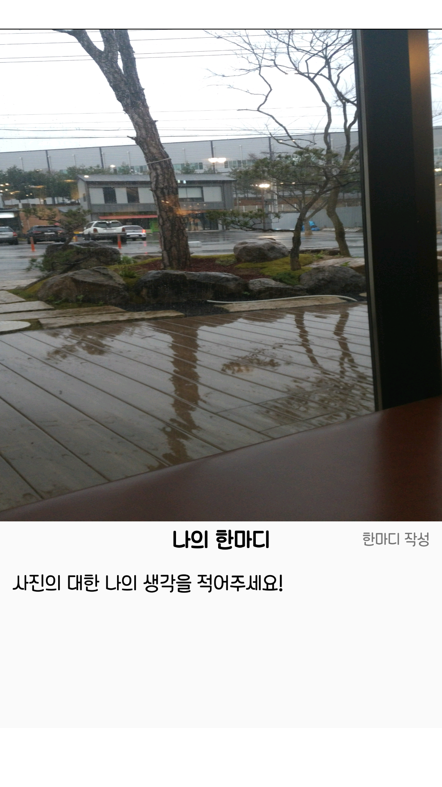

# RESUME

# 경력

**[왓비타](http://www.whatvita.kr)**

* 담당: 안드로이드 앱 개발
* 기간: 2017.05 ~ 2017.12
* 자신에게 맞는 비타민 추천 앱

  - 입사 당시 하이브리드 앱으로 서비스 운영
  - WebView 와 JavaScript 연동 
  - 페이스북 로그인,카카오톡 로그인,구글 로그인 구현 
  - FCM을 이용하여 Push알림 구현
  - 기존 하이브리드 앱을 네이티브 앱으로 개발
  - UI 프로토타입 개발

**쿠키크랙**

* 담당: 안드로이드 앱 개발
* 기간: 2015.09 ~ 2015.12
* 자신만의 레시피 공유 앱

  - 신규버전 앱 UI 프로토타입 개발
  - 기획참여,서비스설계,아이디어회의참여

# 프로젝트

**왓비타**

* 소속: 왓비타
* 담당: 안드로이드 앱 개발
* 기간: 2017.09 ~ 2017.12
* 자신의 몸 상태를 입력하면 거기에 맞는 약을 추천해주고, 1:1 상담과 약 구매를 도와주는 앱
* 사용기술: Java,Retrofit,OkHttp,Rxjava ..

 
 

**쿠키크랙**

* 소속: 쿠키크랙
* 담당: 안드로이드 앱 개발
* 기간: 2015.09 ~ 2015.12
* 자신만의 레시피를 앱에 공유하여 여러 사용자들이 요리을 간단하게 만들 수 있게 도와주는 앱
* 사용기술: Java,Retrofit,OkHttp,Rxjava ..

# 기타 프로젝트

### 1.Photo Diary 앱 

* 구글 플레이 스토어에 출시 중

* 간단한 그림(사진)일기 앱
	* 사진마다 글을 입력하고 나중에 확인하면 그때의 기억이 더 많이 떠오르지 않을까 하는 마음에 만들었습니다.
	* 이미지 관리 , 레이아웃 학습 , 플레이 스토어에 출시 경험

* 사용기술: Java, Glide , MultipleImageSelect , tedpermission , jsoup..
<!-- 앱 설명 -->
	
	해당 지역 입력 후 폴더 생성하면 폴더 사진은 랜덤으로 임시 이미지가 적용.
	폴더 생성 후 사진 등록하면 폴더 이미지가 등록한 마지막 사진으로 적용.
	등록한 각 사진에 "나의 한마디" 작성.

    

### 2.네이버 검색(영화) API

* 네이버 검색 API를 이용한 영화검색
	* 네크워크을 이해하기 위해 제작

* 사용기술: Java, Butterknife, Retrofit, Okhttp, Glide ..
<!-- 앱 설명 -->
	
	검색창에 영화제목을 검색하면 검색한 영화가 리스트형식으로 출력됩니다.
	출력되는 데이터는 제목,영어제목,제작년도,감독,평점,영화이미지 입니다.
	검색으로 출력된 데이터를 클릭하면 WebView로 클릭한 영화의 자세한 정보페이지로 이동합니다.

 

### 3.평화촛불

* 간단한 촛불 앱
	* 구글 스토어에 등록 경험 하기 위해 제작

* 사용기술: Java,Butterknife, Animation-list ..
<!-- 앱 설명 -->

	상단 텍스트는 내용과 위치(상단,하단) 설정 가능합니다.
	20장의 촛불 이미지를 사용하여 타오르는 촛불을 구현.
	촛불 세기 및 촛불이미지 변경 가능합니다.
	종이컵 이미지 중앙 구호 설정 기능이 있습니다.

 

